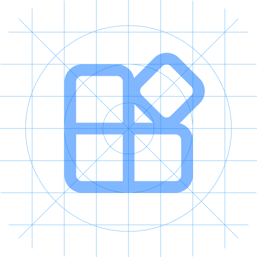

<div align="center">

<h1>Class Widgets 2 Plugin Template</h1>

<p>Class Widgets 2 插件模板</p>

<!--[](https://github.com/Class-Widgets/plugin-template-v2/releases/latest)--->

[](https://github.com/Class-Widgets/plugin-template-v2)
[](https://github.com/Class-Widgets/plugin-template-v2)
[](https://github.com/Class-Widgets/plugin-template-v2)

</div>

> [!CAUTION]
> 
> 本项目还处**在开发**阶段，API 接口可能随时发生变化，敬请谅解。
> 
> This project is still **in development**. The API may change at any time, so please bear with us.

## 介绍 / Introduction
一个基于 [Class Widgets 2](https://github.com/rinlit-233-shiroko/class-widgets-2) 的插件模板。

## 使用 / Usage
1. 安装 [Class Widgets 2 SDK](https://github.com/Class-Widgets/class-widgets-sdk) 依赖 / 
Install the [Class Widgets 2 SDK](https://github.com/Class-Widgets/class-widgets-sdk) dependencies
```bash
pip install class-widgets-sdk
```

2. 在终端运行 `cw-plugin-pack` 以打包插件 /
Run `cw-plugin-pack` to pack the plugin in the terminal
```bash
cw-plugin-pack
```

3. 在 Class Widgets 2 -> "设置" -> "插件"中导入打包好的插件 /
Import the packed plugin in "Settings" -> "Plugins" in Class Widgets 2

## 自动发布 / Auto Release
通过 GitHub Actions 实现自动发布功能，推送 tag 时自动生成 release。

### 使用方法 / How to Use
1. 推送 tag 到 GitHub（格式：`v*.*.*`）：
```bash
git tag v1.0.0
git push origin v1.0.0
```

2. GitHub Actions 会自动：
   - 使用 `cw-plugin-pack` 打包插件
   - 生成 `.cwplugin` 和 `.zip` 两种格式
   - 创建 GitHub Release 并上传发布包

3. 在 GitHub Release 页面下载发布包

## 致谢 / Acknowledgements
### 引用资源 / Credits
- [Class Widgets 2](https://github.com/rinlit-233-shiroko/class-widgets-2)
- [Class Widgets 2 SDK](https://github.com/Class-Widgets/class-widgets-sdk)

## 版权 / License
本项目基于 MIT 协议开源，详情请参阅 [LICENSE](https://github.com/rinlit-233-shiroko/class-widgets-2-plugin-template/blob/main/LICENSE) 文件。

The project is licensed under the MIT license. Please refer to the [LICENSE](https://github.com/rinlit-233-shiroko/class-widgets-2-plugin-template/blob/main/LICENSE) file for details.


